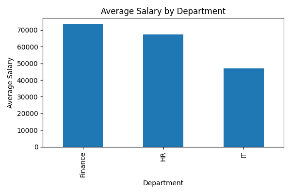

# HR Analytics using Pandas

This project analyzes employee data to extract insights related to:
- Skilled employee identification
- Salary distribution
- Experience classification
- Salary revision policy impact
- High-value IT employees

## Tools Used
- Python
- Pandas
- NumPy
- Matplotlib

## Key Concepts
- Boolean indexing
- Feature engineering
- GroupBy aggregation
- Data visualization

## Outcome
The project helps HR teams understand workforce structure and salary trends.

## How to Run
1. Install Python
2. Run `pip install pandas matplotlib numpy`
3. Execute `python HR_Analytics.py`

## Visualization Output

